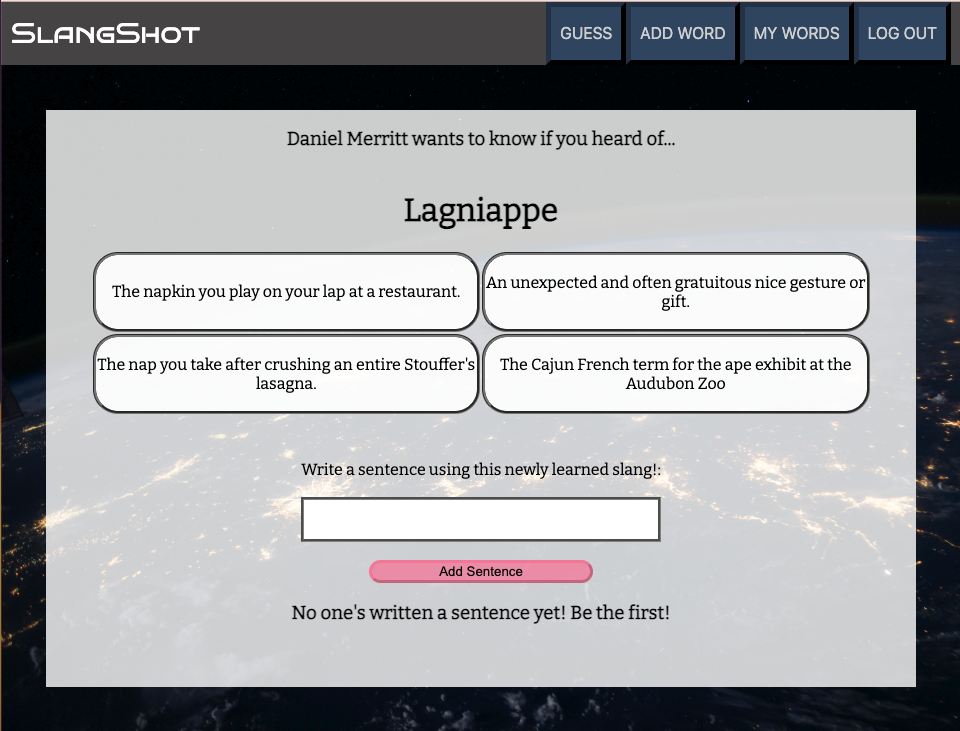

# SlangShot: The Local Lexicon with a Global Audience.
### [Sling your Slang Here!](https://slangshot.fly.dev/)

>"Language is not a genetic gift, it is a social gift. Learning a new language is becoming a member of the club – the community of speakers of that language." — *Frank Smith*

Growing up in a diverse neighborhood in New Orleans, I always loved hearing the different ways my neighbors talked. I would learn the different phrases and implement them into my daily verbiage. 

As I grew older, I realized that I commonly used phrases and words that confounded my college classmates. After all, if you're not from the Bayou, how would you know "Oh, they're from North of the I-10" meant they season their crawfish after they boil it?

>"Our language is funny – a ‘fat chance’ and a ‘slim chance’ are the same thing. — *J. Gustav White*   

This app is an educational tool for me and others to learn about the different dictionaries that English speakers use. Sign in and click "guess," and you'll be able to learn from another user's culture. Once you get a hang of it, please add your own words in order to teach others your unique verbiage!

Wanna see how the sausage was made? Here's a link to my [Trelle](https://trello.com/b/KnZRmHVm/slangshot-the-local-lexicon-with-a-global-audience) 

## Attributions

[Animate.CSS](animate.style)

Slingshot favicon by [icons8](https://icons8.com/icons/set/slingshot)

Sound effects by [SPANAC](https://www.freesoundslibrary.com/sike-sound-effect/) and [MattLeschuck](https://pixabay.com/sound-effects/success-bell-6776/)

Backgrounds by <a href="https://unsplash.com/pt-br/@lanirudhreddy?utm_source=unsplash&utm_medium=referral&utm_content=creditCopyText">ANIRUDH</a>, <a href="https://unsplash.com/@nasa?utm_source=unsplash&utm_medium=referral&utm_content=creditCopyText">NASA</a>, <a href="https://unsplash.com/@grakozy?utm_source=unsplash&utm_medium=referral&utm_content=creditCopyText">Greg Rakozy</a> on <a href="https://unsplash.com/images/nature/earth?utm_source=unsplash&utm_medium=referral&utm_content=creditCopyText">Unsplash</a>

## Technologies Used
- Mongoose
- Express
- Node.js
- MongoDB
- Google OAuth
- Fly.io
- JavaScript
- EJS
- CSS
- Git

## Ice Box
- [ ] Filter slang by regions.
- [ ] Point accrual for the questions. Have a ranked page to see top scorers.
- [ ] Like sentences and have them raise to the top of the sentence section.